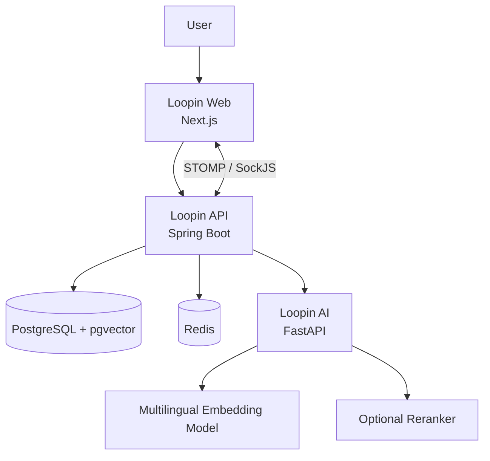

<div align="center">

# Loopin

### Discover events. Find your group. Go together.

Loopin is a social event discovery platform that helps people find nearby events and connect with like-minded people to attend them together.

[Repositories](#repositories) · [Architecture](#architecture) · [Current Status](#current-status)

</div>

---

## About Loopin

Finding an interesting event is easy. Finding someone to attend it with is often the difficult part.

Loopin brings event discovery and small-group coordination into one platform. Users can explore events, create or join event-specific groups, communicate with accepted members, and build a history of their participation.

The platform is being developed as a modular system with separate applications for the web client, core backend, and semantic recommendation service.

## Core Features

* Discover and browse local events
* View event details, locations, interests, and participation information
* Create small groups around specific events
* Send and manage group join requests
* Control group membership through admin approval
* Communicate through real-time group chat
* Maintain user profiles and event participation history
* Archive groups automatically after events are completed
* Generate event-related user badges
* Recommend relevant events using multilingual semantic search
* Rank recommendation candidates with an optional reranking model

## Architecture



### Request Flow

1. The web application sends authenticated requests to the Loopin API.
2. The API owns users, events, groups, permissions, chat, and recommendation retrieval.
3. PostgreSQL stores relational application data and vector embeddings.
4. The API retrieves recommendation candidates using `pgvector`.
5. Loopin AI performs model inference for embeddings and optional reranking.
6. Real-time group messages are delivered through STOMP over SockJS/WebSocket.

## Repositories

| Repository                                             | Description                                                                                                              | Main Technologies                              |
| ------------------------------------------------------ | ------------------------------------------------------------------------------------------------------------------------ | ---------------------------------------------- |
| [loopin-api](https://github.com/the-loopin/loopin-api) | Core backend for authentication, profiles, events, groups, join requests, chat, badges, and recommendation orchestration | Java, Spring Boot, PostgreSQL, Redis, pgvector |
| [loopin-web](https://github.com/the-loopin/loopin-web) | User-facing web application for event discovery, group management, profiles, maps, and real-time chat                    | Next.js, React, TypeScript                     |
| [loopin-ai](https://github.com/the-loopin/loopin-ai)   | Internal inference service for multilingual embeddings and candidate reranking                                           | Python, FastAPI, Hugging Face                  |

## Backend Engineering

The Loopin API is designed around clear ownership and security boundaries.

Its responsibilities include:

* Authentication and authorization
* Event and activity management
* Group ownership and membership rules
* Join-request approval workflows
* Real-time message authorization
* Event lifecycle management
* Recommendation candidate retrieval
* Integration with the internal AI inference service
* API documentation and automated verification

Quality and security checks include:

* Automated tests with Maven
* JaCoCo coverage enforcement
* OWASP dependency scanning
* Pull-request dependency review
* Container vulnerability scanning with Trivy
* GitHub Actions continuous integration
* Docker-based local development

## Real-Time Communication

Group chat uses STOMP messaging over SockJS/WebSocket.

The system supports:

* Authorized group subscriptions
* Group-specific messaging topics
* Persistent REST message history
* Reconnection and history synchronization
* Server-side membership validation
* Controlled message access for accepted members

## Semantic Recommendations

Loopin uses a dedicated internal AI service rather than embedding model inference directly into the main API.

The current recommendation pipeline uses:

* `multilingual-e5-small` for multilingual text embeddings
* PostgreSQL with `pgvector` for candidate retrieval
* `bge-reranker-v2-m3` as an optional reranker
* Bounded inference concurrency
* Explicit overload rejection instead of unbounded queues
* Authenticated internal service communication
* Prometheus-compatible inference and request metrics

The API remains responsible for user data, permissions, event retrieval, and final recommendation orchestration. Loopin AI owns model inference only.

## Reliability and Security

The system is being developed with production failure modes in mind.

Important safeguards include:

* Ownership and role-based authorization
* Group membership validation for chat access
* Restricted internal AI endpoints
* Request correlation IDs
* Controlled inference queues
* Explicit readiness and liveness endpoints
* Secret-based service authentication
* Container and dependency vulnerability scanning
* Rate limiting and bounded resource usage
* Separation between application data and inference responsibilities

## Local Development

Each repository contains its own setup and development documentation.

### Clone the repositories

```bash
git clone https://github.com/the-loopin/loopin-api.git
git clone https://github.com/the-loopin/loopin-web.git
git clone https://github.com/the-loopin/loopin-ai.git
```

### Start with the backend

```bash
cd loopin-api
cp .env.example .env
docker compose up --build -d
./mvnw spring-boot:run
```

### Start the web application

```bash
cd loopin-web
npm install
npm run dev
```

### Start the AI service

```bash
cd loopin-ai
pip install -r requirements.txt
uvicorn app.main:app --reload
```

Refer to the README and documentation inside each repository for environment variables, service dependencies, testing commands, and deployment details.

## Current Status

Loopin is under active development.

The main platform currently includes:

* A Spring Boot backend with event, group, profile, and chat domains
* A Next.js web application connected to the backend
* Real-time group messaging
* Docker-based development infrastructure
* Automated testing and security checks
* A separate CPU-oriented semantic recommendation service
* Vector retrieval and optional reranking support

The current focus is improving end-to-end integration, recommendation quality, deployment reliability, user experience, and production readiness.

## Project Structure

```text
the-loopin/
├── loopin-api     # Core backend and business logic
├── loopin-web     # Web application and user interface
├── loopin-ai      # Embedding and reranking inference
└── .github        # Organization profile and shared configuration
```

---

<div align="center">

Built around the idea that discovering an event should also make it easier to find the people to experience it with.

</div>
